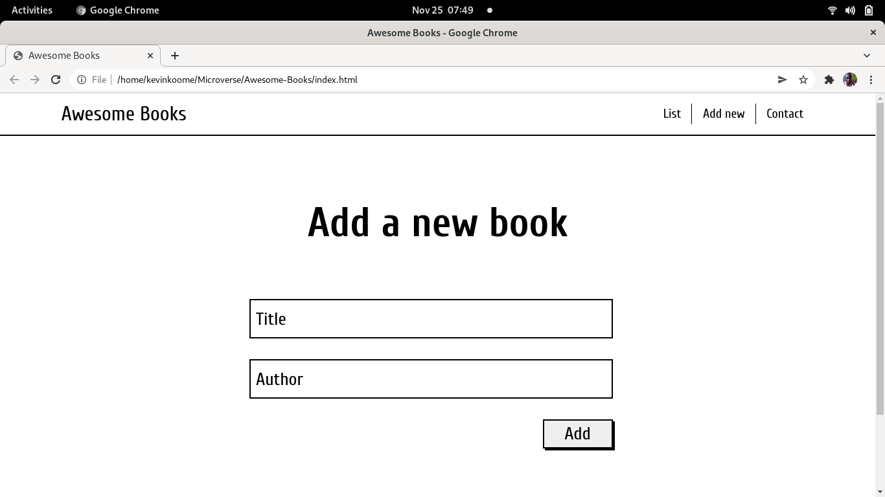

# Awesome Books

> This is a site for creating a list of person's favourite books that allows to add and remove those books in and out.

At this stage, it is possible to add and remove books in and out of the list.

## Built With

- HTML
- JavaScript
- GitHub

## Live Demo

[Click here to check how it works!](https://koomekevo.github.io/Awesome-Books/)

## Getting Started

To get a local copy up and running follow these simple example steps.

If you want to see how it works without any installations, visit live demo link once again!

As for the installation, follow these steps!

- Open the repository
- Download ZIP-archive to your PC
- Unpack the archive
- Open the index.html file
- Use the site!

## Authors

👤 **Kevin Koome**

- GitHub: [@koomekevo](https://github.com/koomekevo)
- Twitter: [@koomekevo](https://twitter.com/koomekevo)
- LinkedIn: [LinkedIn](https://ke.linkedin.com/in/kevin-koome-aab84186)

👤 **Natalie Poletaeva**

- GitHub: [@NataliaPoletaeva](https://github.com/NataliaPoletaeva)
- Twitter: [@Fly_Meets](https://twitter.com/Fly_Meets)

## 🤝 Contributing

Contributions, issues, and feature requests are welcome!

Feel free to check the [issues page](../../issues/).

## Show your support

Give a ⭐️ if you like this project!

## Acknowledgments

- Hat tip to anyone whose code was used
- Inspiration
- etc

## 📝 License

This project is [MIT](./MIT.md) licensed.
